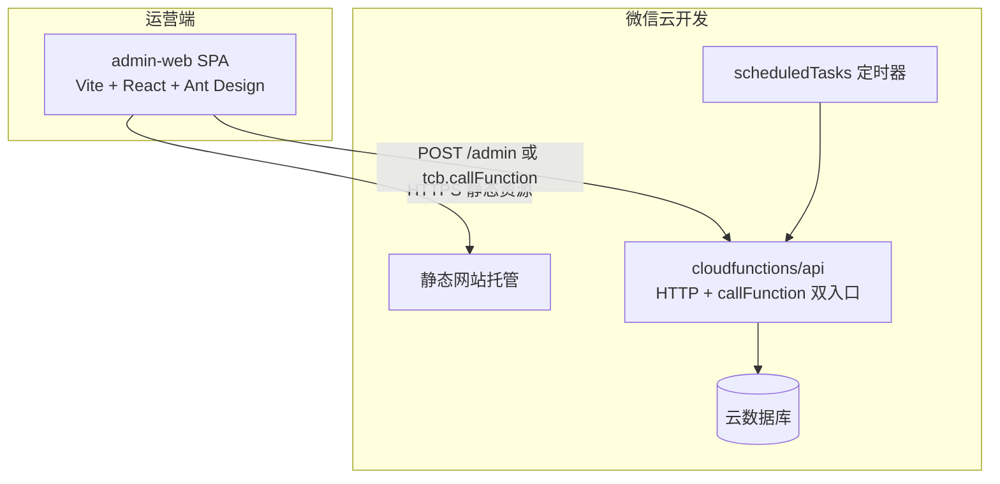
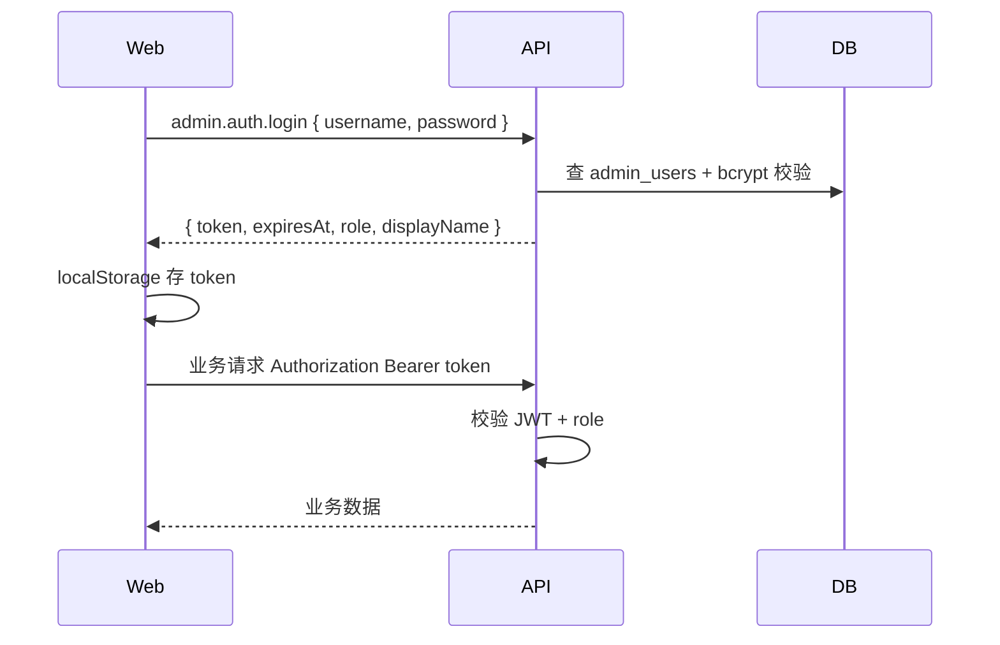

# 书漂漂 Web 运营后台 — 详细设计

**日期**：2026-06-29  
**状态**：待实施（用户已确认精简方案）  
**版本**：v1.1-slim

## 1. 决策摘要

| 项 | 确认结论 |
|----|----------|
| 形态 | **独立 Web 后台（方案 B）** 作为主运营入口 |
| 使用人数 | **仅本人**，暂不做多角色/多人权限 |
| 认证 | 单账号密码 + JWT（够用的最简方案） |
| 部署 | **云开发静态网站托管**（与现有云环境同账号） |
| 地址权限 | 订单详情展示 **完整收货地址** |
| **v1 模块** | **用户、订单、待办、在漂书籍管理（含置顶排序）** |
| 在漂书籍 | 改积分/分类、置顶（**最多 30 本**）、下架/恢复；申诉人工审核 |
| 用户侧 | **不展示**「运营调价」等标记 |
| 延后 | 纠纷/举报 Web 模块、数据分析看板迁移、Catalog 治理、多管理员 |

### 1.1 是否会改动现有产品代码？

**会，但范围很小，且用户几乎无感知。**

| 改动位置 | 原因 | 用户是否可见 |
|----------|------|--------------|
| `cloudfunctions/api/handlers/pool.js` | 读取 `opsPinned`/`opsCategory`/`opsHidden`，置顶排序与分类覆盖 | 仅置顶书排位变化、分类筛选更准确；**无新 UI 文案** |
| `cloudfunctions/api/handlers/drift.js`（可选） | 申诉列表供后台 `approve`/`reject` | 无 |
| `cloudfunctions/api/index.js` | 注册 `admin.*` 路由 + HTTP 入口 | 无 |
| `cloudfunctions/api/lib/collections.js` | 新增 `admin_users`（可选 `admin_audit_logs`） | 无 |

**不需要改动：**

- 小程序页面（`miniprogram/pages/*`）—— 运营后台是独立 Web，不进小程序
- 书卡/详情 UI —— 不展示运营标记
- 用户上漂、接漂、发货流程 —— 逻辑不变，仅后台可覆盖积分/分类/置顶

结论：**现有 C 端产品只需云函数侧少量补丁**；Web 后台是增量建设，不替换小程序。

---

## 2. 目标与非目标

### 2.1 目标（v1 精简）

- 本人日常运营：**查用户、处理订单与待办、管理在漂书籍与置顶排序**。
- 复用云数据库与 `api` 云函数，新增 Web 专用 `admin.*` 接口。
- 置顶上限 **30 本**；运营改积分不在用户侧展示标记。

### 2.2 非目标（v1 精简版不做）

- 多角色权限（viewer/operator/superadmin）—— 单账号即可
- Web 端数据看板（继续用小程序 `pages/admin/dashboard` 看数据，或以后再迁）
- 纠纷/举报 Web 工单（仍可在云开发控制台或后续迭代）
- Catalog 导入、系统迁移 Web 化
- 用户侧「运营调价」书卡标记
- 微信扫码登录、客服 IM、复杂 BI

---

## 3. 总体架构



### 3.1 目录规划

```
shupiaopiao-cloud/
├── admin-web/                      # 新建：Web 运营后台
│   ├── src/
│   │   ├── api/                    # 封装 admin 请求 + JWT
│   │   ├── pages/                  # 页面模块
│   │   ├── components/
│   │   └── router/
│   ├── package.json
│   └── vite.config.ts
├── cloudfunctions/api/
│   ├── handlers/admin/             # 按域拆分
│   │   ├── auth.js
│   │   ├── analytics.js            # 自现有 admin.js 迁移
│   │   ├── users.js
│   │   ├── orders.js
│   │   ├── drifts.js               # 在漂书籍 + 置顶
│   │   ├── disputes.js
│   │   ├── reports.js
│   │   ├── catalog.js
│   │   └── system.js
│   └── lib/
│       ├── adminAuth.js            # JWT 签发/校验 + 角色
│       └── adminAudit.js           # 审计写入
└── miniprogram/pages/admin/        # 保留，只读
```

### 3.2 接口双通道

| 通道 | 调用方 | 鉴权 |
|------|--------|------|
| `wx.cloud.callFunction` | 小程序 admin 页 | `ADMIN_OPENIDS` 白名单（现有） |
| **HTTP 触发器** `POST /admin` | Web 后台 | `Authorization: Bearer <JWT>` |

`api/index.js` 统一解析 `action`，Web 请求体：

```json
{
  "action": "admin.drifts.update",
  "data": { "driftId": "...", "coinValue": 8 }
}
```

HTTP 响应与现有 `{ code, data, message }` 格式一致。

### 3.3 静态托管与构建

- 构建产物 `admin-web/dist` 上传至云开发静态托管根路径 `/admin/`（或独立子域）。
- 环境变量通过构建时 `.env.production` 注入：`VITE_API_BASE`、`VITE_CLOUDBASE_ENV`。
- 使用 `@cloudbase/js-sdk` 调用云函数 HTTP 网关，或直接 `fetch` 到 HTTP 触发 URL。

---

## 4. 认证与权限

### 4.1 数据模型

**集合 `admin_users`（新建）**

| 字段 | 类型 | 说明 |
|------|------|------|
| `_id` | string | 主键 |
| `username` | string | 登录名，唯一 |
| `passwordHash` | string | bcrypt |
| `displayName` | string | 展示名 |
| `role` | string | `viewer` / `operator` / `superadmin` |
| `status` | string | `active` / `disabled` |
| `lastLoginAt` | string | ISO |
| `createdAt` | string | ISO |

**集合 `admin_audit_logs`（新建）**

| 字段 | 说明 |
|------|------|
| `operatorId` | admin_users._id |
| `operatorName` | 冗余展示 |
| `action` | 如 `drifts.updateCoin` |
| `targetType` | `drift` / `order` / `user` … |
| `targetId` | 对象 ID |
| `before` / `after` | JSON 快照（敏感字段可脱敏） |
| `reason` | 操作原因（调账、下架等必填） |
| `ip` | 请求 IP（HTTP 头） |
| `createdAt` | ISO |

**云环境变量**

| 变量 | 说明 |
|------|------|
| `ADMIN_JWT_SECRET` | JWT 签名密钥 |
| `ADMIN_JWT_TTL_HOURS` | 默认 12 |
| `ADMIN_OPENIDS` | 保留，小程序 admin 白名单 |

### 4.2 权限（v1 精简：单账号）

仅一个 `admin_users` 记录（环境变量或种子脚本初始化），**拥有全部能力**，不做角色分级。

| 能力 | v1 |
|------|:--:|
| 用户 / 订单 / 待办 / 在漂书籍 | ✓ |
| 完整收货地址 | ✓ |
| 调账、订单介入、置顶、改积分/分类 | ✓ |
| 申诉审核（`approve`/`reject`） | ✓ |
| 审计日志 | 可选（建议仅记写操作，单人可简化） |

### 4.3 登录流程



- 密码错误统一返回「用户名或密码错误」，不泄露用户是否存在。
- Token 过期返回 401，前端跳转登录页。
- 首次部署：脚本或 `superadmin` 接口种子账号（仅云控制台可触发一次）。

---

## 5. 功能模块设计

### 5.1 数据分析中心

**迁移现有能力**（自 `handlers/admin.js` → `handlers/admin/analytics.js`）：

- `admin.overview` / `admin.trend` / `admin.funnel` / `admin.conclusion`
- `admin.events` / `admin.ledger` / `admin.rebuild` / `admin.export`

**Web 页面**：`/dashboard`

| 区块 | 内容 |
|------|------|
| 概览卡片 | DAU、新增、上漂、接漂、完成、积分发行/消耗 |
| 趋势图 | 7/14/30 天可切换，ECharts 折线/柱状 |
| 漏斗 | 上漂→在池→被接→寄出→完成 |
| 智能结论 | 现有规则引擎输出，按 warn/info 着色 |
| 快捷入口 | 跳转流水明细、待办队列 |

**v1 增强接口**：

- `admin.analytics.retention` — D1/D7 留存曲线
- `admin.analytics.categoryBreakdown` — 在漂/完成订单品类分布

---

### 5.2 用户管理

**页面**：`/users`、`/users/:id`

**接口**：

| action | 说明 |
|--------|------|
| `admin.users.list` | 分页；筛选：注册时间、信用区间、有无在途订单 |
| `admin.users.detail` | 用户概览 + 书架统计 + 最近漂流 |
| `admin.users.adjustCoin` | 调整公益积分，`reason` 必填，写 `coin_transactions` |
| `admin.users.adjustCredit` | 调整信用分，写 `credit_logs` |
| `admin.users.restrict` | 设置 `disputeRestricted`、接漂/上漂限制标记 |
| `admin.users.ledger` | 该用户积分/信用流水 |

**展示字段**：昵称、注册时间、积分余额/冻结、信用分、在途订单数、违规次数、邀请人。

**openid**：`operator` 见脱敏（前 6 + 后 4），`superadmin` 可见完整（审计记录）。

---

### 5.3 订单管理

**页面**：`/orders`、`/orders/:id`

**接口**：

| action | 说明 |
|--------|------|
| `admin.orders.list` | 状态、时间、赠书方/接书方、关键词（订单号/书名） |
| `admin.orders.detail` | 订单 + 漂流 + 书籍 + 双方用户 + **完整 addressSnapshot** |
| `admin.orders.timeline` | `drift_order_events` 时间线 |
| `admin.orders.forceCancel` | 强制取消（复用 drift 取消逻辑 + 审计） |
| `admin.orders.forceComplete` | 代确认收货完成 |
| `admin.orders.extendDeadline` | 延长发货截止或自动完成期限 |

**待办队列**（首页 Widget + `/orders/todos`）：

| 队列 | 规则 |
|------|------|
| 超时未发货 | `PENDING_SHIP` 且 `shipDeadlineAt` 已过 |
| 即将自动完成 | `SHIPPED` 且 `autoCompleteAt` 24h 内 |
| 纠纷中 | `DISPUTED` |
| 高价值在途 | `coinValue >= 15` 且未 `DONE` |

地址展示（**完整，不脱敏**）：

```
姓名 / 手机
省市区 + 详细地址
```

数据来源：`order.addressSnapshot`，缺失时按 `addressId` 回查 `addresses`（与 `resolveOrderAddressSnapshot` 逻辑一致）。

---

### 5.4 纠纷工单

**页面**：`/disputes`、`/disputes/:id`

**接口**：

| action | 说明 |
|--------|------|
| `admin.disputes.list` | 状态筛选、超 48h 未处理标红 |
| `admin.disputes.detail` | 争议内容 + 关联订单（含完整地址） |
| `admin.disputes.resolve` | 判责结果、关闭纠纷、可选联动信用/积分 |

复用 `drift_disputes` 集合；处置后更新订单状态并写 `drift_order_events`。

---

### 5.5 举报处理

**页面**：`/reports`

**接口**：

| action | 说明 |
|--------|------|
| `admin.reports.list` | `status: OPEN` 优先 |
| `admin.reports.detail` | 举报原因 + 关联对象快照 |
| `admin.reports.resolve` | `IGNORE` / `WARN_USER` / `HIDE_DRIFT` / `REMOVE_DRIFT` |

处置 `HIDE_DRIFT` 时可写 `drift.opsHidden = true`（见 §5.6），与举报计数逻辑并存。

---

### 5.6 在漂书籍管理（新增重点）

**页面**：`/pool`（在漂列表）、`/pool/:driftId`（详情与编辑）

#### 5.6.1 列表能力

**接口** `admin.drifts.list`：

- 筛选：`IN_POOL`（默认）、`PENDING_REVIEW`、`CLAIMED`、全部状态
- 排序：创建时间、积分、是否置顶、举报数
- 搜索：书名、ISBN、赠书方昵称、driftId
- 展示：封面、书名、积分、分类、品相、赠书方、上架时间、置顶状态、举报数、`opsHidden`

#### 5.6.2 运营字段（`drifts` 文档扩展）

| 字段 | 类型 | 说明 |
|------|------|------|
| `opsCategory` | string | 运营覆盖广场分类：`children`/`literature`/`business`/`other`；空则走算法 |
| `opsCoinValue` | number | 运营覆盖积分；设置时同步更新 `coinValue`，并记 `coinValueOpsOverride: true` |
| `opsPinned` | boolean | 是否人工置顶 |
| `opsPinRank` | number | 置顶排序，1 最高，支持多本同时置顶 |
| `opsPinnedAt` | string | 置顶时间 |
| `opsPinnedUntil` | string | 可选，到期自动取消置顶（定时任务扫描） |
| `opsPinnedBy` | string | admin_users._id |
| `opsHidden` | boolean | 运营强制下架（广场不可见，不影响已接订单） |
| `opsNote` | string | 内部备注，用户不可见 |

#### 5.6.3 修改积分

**接口** `admin.drifts.updateCoin`：

```json
{
  "driftId": "xxx",
  "coinValue": 8,
  "reason": "运营调价：活动推荐"
}
```

规则：

- 仅 `IN_POOL` 或 `PENDING_REVIEW` 可改。
- 运营可超过 `systemCoinValue`（与用户侧 `resolveRequestedCoinValue` 不同），但必须填 `reason` 并写审计。
- 更新：`coinValue`、`opsCoinValue`、`coinValueOpsOverride: true`。
- 若已有接漂意向（`drift_wants`），不阻断修改，但在详情中提示「积分已变更」。

#### 5.6.4 修改分类

**接口** `admin.drifts.updateCategory`：

```json
{
  "driftId": "xxx",
  "opsCategory": "children",
  "reason": "人工校正为童书"
}
```

**广场侧改动**（`pool.js`）：

```javascript
function classifyCategory(book = {}, shelfRow = null, drift = {}) {
  if (drift.opsCategory) return drift.opsCategory;
  // ... 现有逻辑
}
```

`formatPoolItem` 输出 `category` / `categoryLabel` 使用覆盖后的值；筛选与推荐权重同步生效。

#### 5.6.5 人工置顶推荐

**接口**：

| action | 说明 |
|--------|------|
| `admin.drifts.pin` | `{ driftId, opsPinRank?, opsPinnedUntil? }` |
| `admin.drifts.unpin` | 取消置顶 |
| `admin.drifts.reorderPins` | `{ items: [{ driftId, opsPinRank }] }` 批量调整顺序 |

**广场排序改动**（`pool.js` → `list`）：

在 `rankPoolList` **之前**插入 `applyOpsPinned`：

```javascript
function applyOpsPinned(list = [], nowIso = '') {
  const now = nowIso || new Date().toISOString();
  const pinned = [];
  const rest = [];
  list.forEach((item) => {
    if (item.opsPinned && (!item.opsPinnedUntil || item.opsPinnedUntil > now)) {
      pinned.push(item);
    } else {
      rest.push(item);
    }
  });
  pinned.sort((a, b) => (a.opsPinRank || 999) - (b.opsPinRank || 999));
  return [...pinned, ...rest];
}
```

置顶书仍参与后续 `rankPoolList` 的相对顺序仅在同为置顶时由 `opsPinRank` 决定；非置顶书籍保持原推荐算法。

**Web 置顶管理 UI**：

- 当前置顶列表（可拖拽排序）
- 从在漂列表一键置顶
- 设置到期时间（如活动 7 天）

#### 5.6.6 下架与恢复

| action | 说明 |
|--------|------|
| `admin.drifts.hide` | `opsHidden = true`，广场不可见 |
| `admin.drifts.show` | `opsHidden = false` |
| `admin.drifts.removeFromPool` | 状态改为 `CANCELLED`（仅 `IN_POOL`，无进行中订单） |

`filterVisibleDrifts` 增加：`if (drift.opsHidden) exclude`。

#### 5.6.7 审核队列

`PENDING_REVIEW` / `REJECTED` 漂流：

| action | 说明 |
|--------|------|
| `admin.drifts.approve` | → `IN_POOL` |
| `admin.drifts.reject` | → `REJECTED` + `rejectReason` |

（与用户侧 `runAutoCheck` 并行：自动通过仍直接 `IN_POOL`；人工复审主要处理申诉 `drift.appeal` 积压。）

---

### 5.7 积分流水与调账

**页面**：`/ledger`（全局流水，增强现有 `admin.ledger`）

筛选：用户、类型、时间、金额区间；导出 CSV。

---

### 5.8 系统运维

**页面**：`/system`（仅 superadmin）

| action | 说明 |
|--------|------|
| `admin.system.tasks` | 最近 `scheduledTasks` / `dailyMetrics` 执行摘要 |
| `admin.system.trigger` | `rebuild` / `maintainDriftOrders` / `refreshBooks` |
| `admin.audit.list` | 审计日志查询 |

---

## 6. Web 前端信息架构

```
登录
└── 布局（侧边栏 + 顶栏）
    ├── 数据看板          /dashboard
    ├── 待办中心          /todos
    ├── 在漂书籍          /pool          ← 置顶管理 Tab
    ├── 订单管理          /orders
    ├── 纠纷工单          /disputes
    ├── 举报处理          /reports
    ├── 用户管理          /users
    ├── 流水明细          /ledger
    └── 系统设置          /system        （超管）
```

**技术栈**：Vite 5 + React 18 + TypeScript + Ant Design 5 + ECharts 5 + React Router 6。

**交互约定**：

- 所有写操作弹窗确认 + 必填「操作原因」
- 列表默认 20 条分页，支持导出当前筛选结果
- 订单/纠纷详情页固定展示地址卡片（完整）

---

## 7. 后端改造要点

### 7.1 HTTP 触发器

`cloudfunctions/api/config.json` 增加：

```json
{
  "name": "adminHttp",
  "type": "http",
  "config": "admin"
}
```

`exports.main` 分支：若 `event.httpMethod`，走 HTTP 解析；否则保持现有 `callFunction` 逻辑。

CORS：允许静态托管域名，`OPTIONS` 预检。

### 7.2 鉴权中间件

```javascript
// lib/adminAuth.js
async function resolveAdminContext(event) {
  const bearer = parseBearer(event.headers);
  if (bearer) return verifyJwt(bearer);           // Web
  const openid = cloud.getWXContext().OPENID;
  if (openid && isAdminOpenid(openid)) return { role: 'superadmin', source: 'openid' };
  return null;
}
```

`admin.*` 路由统一经 `requireAdminRole(ctx, minRole)`。

### 7.3 集合变更

`collections.js` 追加：

```javascript
'admin_users',
'admin_audit_logs',
```

### 7.4 兼容性

- 现有 `admin.overview` 等 action **路径不变**，小程序 admin 无需改动即可继续用。
- 新增 action 仅 Web 调用，不暴露给小程序用户路由表。

---

## 8. 安全与合规

1. **网络**：静态托管 + 云函数均在腾讯云内网调用；admin HTTP 路径不写入小程序代码。
2. **密码**：bcrypt cost=10；禁止明文存库。
3. **JWT**：HS256，`exp` 12h；登出仅客户端删 token（v1 无黑名单）。
4. **地址**：仅 `operator+` 角色接口返回完整地址；审计日志中地址可脱敏存储。
5. **频率限制**：`admin.auth.login` 同 IP 5 次/分钟失败锁定 15 分钟（内存计数即可）。
6. **小程序过审**：admin 页仍无 Tab 入口；Web 域名不嵌入小程序 web-view。

---

## 9. 实施分期（一期交付 = P0+P1 合并）

用户确认 P1 模块一起做，建议 **单次里程碑交付**（约 3–4 周），内部分阶段联调：

| 周次 | 交付 | 验收标准 |
|------|------|----------|
| W1 | HTTP 入口 + JWT + admin-web 骨架 + 登录 + 看板迁移 | 能登录并看到与小程序一致的核心指标 |
| W2 | 用户 / 订单 / 地址完整展示 / 待办队列 | 能搜用户、看订单、处理超时待办 |
| W3 | 纠纷 / 举报 / 在漂书籍 CRUD + 置顶 + 广场排序上线 | 改积分/分类后广场生效；置顶出现在 feed 顶部 |
| W4 | 审计日志 / 角色 / 合同测试 / 部署文档 | `scripts/test-admin-*` 通过；静态托管可访问 |

### 9.1 测试策略

新增合同测试（不依赖云环境）：

- `scripts/test-admin-auth-contract.js` — JWT 签发/校验、角色门禁
- `scripts/test-admin-drifts-ops-contract.js` — 置顶排序、`opsCategory` 覆盖
- `scripts/test-admin-pool-pinned-contract.js` — `applyOpsPinned` 单元
- 扩展 `scripts/test-analytics-contract.js` — 路由注册

### 9.2 部署 Checklist

1. 云函数环境变量：`ADMIN_JWT_SECRET`、种子超管密码
2. 上传 `api`（含 HTTP 触发器）
3. `system.initDb` 创建新集合
4. 运行种子脚本创建首个 `admin_users`
5. 构建 `admin-web` 并上传静态托管
6. 配置 HTTP 访问路径与 CORS 白名单
7. 运营账号分发 + 修改初始密码

---

## 10. 风险与缓解

| 风险 | 缓解 |
|------|------|
| 云函数 20s 超时，大列表慢 | 分页 + 索引；订单/在漂列表禁止一次拉全量 |
| 运营改积分引发用户争议 | 强制 reason + 审计；详情展示「运营调价」标记（可选 v1.1 用户可见） |
| 置顶过多淹没自然推荐 | 限制同时置顶 ≤ **30** 本；UI 提示 |
| JWT 泄露 | HTTPS only、短 TTL、内网使用 |

---

## 11. 附录：API 路由总表（v1）

```
admin.auth.login
admin.auth.me
admin.auth.changePassword

admin.overview | admin.trend | admin.funnel | admin.conclusion
admin.events | admin.ledger | admin.rebuild | admin.export
admin.analytics.retention | admin.analytics.categoryBreakdown

admin.users.list | .detail | .adjustCoin | .adjustCredit | .restrict | .ledger

admin.orders.list | .detail | .timeline | .forceCancel | .forceComplete | .extendDeadline
admin.orders.todos

admin.disputes.list | .detail | .resolve

admin.reports.list | .detail | .resolve

admin.drifts.list | .detail
admin.drifts.updateCoin | .updateCategory
admin.drifts.pin | .unpin | .reorderPins
admin.drifts.hide | .show | .removeFromPool
admin.drifts.approve | .reject

admin.system.tasks | .trigger
admin.audit.list
```

---

## 12. v1 精简版：范围与工期

### 12.1 Web 页面（仅 5 块）

```
登录
└── 布局
    ├── 待办中心      /todos      超时未发货、即将自动完成、申诉待审
    ├── 订单管理      /orders     列表 + 详情（完整地址）+ 强制取消/代完成
    ├── 在漂书籍      /pool       列表 + 改积分/分类 + 置顶管理（≤30）+ 下架
    └── 用户管理      /users      列表 + 详情 + 调账
```

数据分析仍用现有小程序 `pages/admin/dashboard`（隐藏路径），v1 不重复建设 Web 看板。

### 12.2 API（v1 精简清单）

```
admin.auth.login | admin.auth.me

admin.orders.list | .detail | .todos | .forceCancel | .forceComplete | .extendDeadline
admin.users.list | .detail | .adjustCoin | .adjustCredit
admin.drifts.list | .detail | .updateCoin | .updateCategory
admin.drifts.pin | .unpin | .reorderPins   # 校验总数 ≤ 30
admin.drifts.hide | .show | .removeFromPool
admin.drifts.approve | .reject              # 申诉积压
```

### 12.3 预估工期（单人使用）

| 阶段 | 内容 | 约 |
|------|------|-----|
| A | HTTP + 单账号 JWT + admin-web 脚手架 | 3–4 天 |
| B | 订单 + 待办 + 完整地址 | 3–4 天 |
| C | 在漂书籍 + 置顶 + pool.js 补丁 | 3–4 天 |
| D | 用户 + 调账 + 部署 | 2–3 天 |

合计约 **2 周**可上线自用。

---

## 13. 变更记录

| 日期 | 说明 |
|------|------|
| 2026-06-29 | 初版：方案 B、JWT、静态托管、全量 P1 |
| 2026-06-29 | v1.1-slim：单人使用；聚焦用户/订单/待办/在漂书籍；置顶上限 30；明确 C 端改动范围 |
