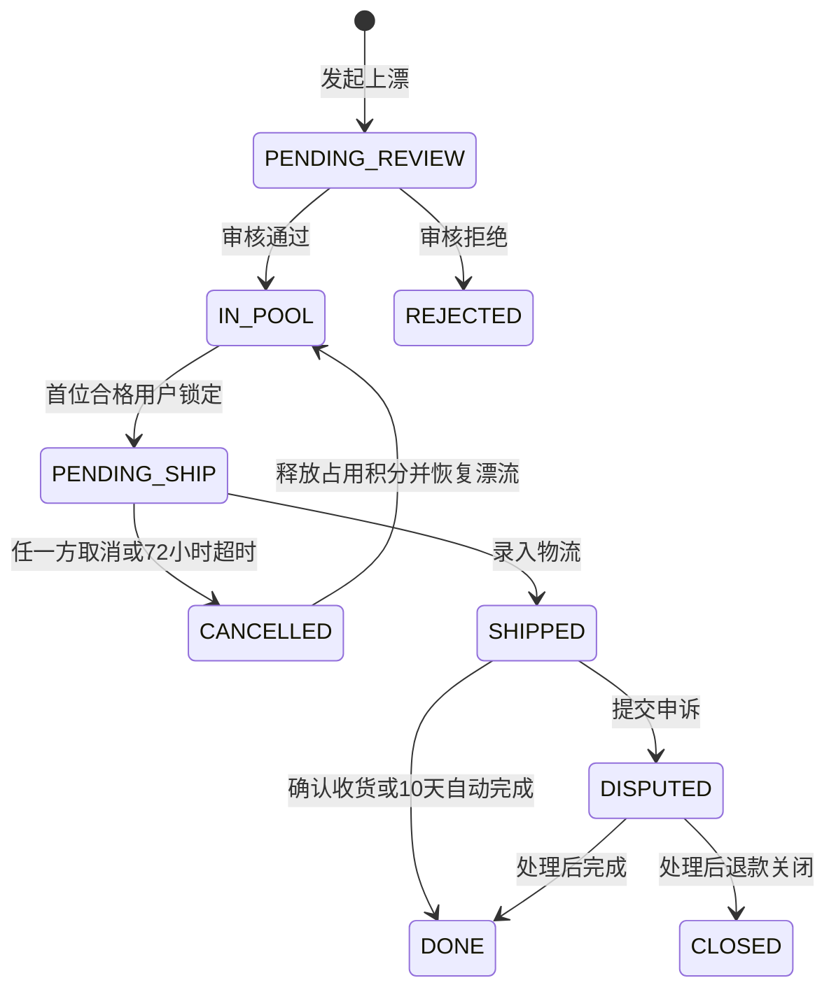

# 漂流履约闭环与双积分体系设计（个人主体合规版）

**日期：** 2026-06-21  
**状态：** 产品规则已确认，待实施计划  
**适用项目：** 微信云开发版“书漂漂”

## 1. 目标

补齐从上漂、接漂、发货、收货、申诉、结算、书架归属到双方评价的完整闭环，并将已确认的公益积分、信用积分规则落实到同一状态机中。

本设计同时约束个人主体提审边界：产品必须保持“个人书架管理 + 闲置图书公益流转信息记录”的定位，不提供图书售卖、资金交易、充值、提现、积分交易、即时聊天或开放论坛能力。

## 2. 已确认的产品决策

- 首位满足条件的接漂用户自动锁定图书。
- 发货前赠书方、接漂方均可取消。
- 赠书方需在锁定后 72 小时内录入物流。
- 录入物流后 10 天自动完成，接漂方可在自动完成前申诉。
- 完成后从赠书方书架移除对应图书，接漂方可一键加入自己的书架。
- 双方可互评，每人每笔漂流记录限一次。
- 公益积分与信用积分均在前台展示，但职责分离、不可互换。

## 3. 当前故障与根因

赠书记录页的“录入快递单号”当前使用：

1. `wx.showActionSheet` 展示 8 家快递公司。
2. 选择后使用可编辑 `wx.showModal` 输入单号。
3. 两层调用均缺少完整失败反馈。

在受影响的微信运行环境中，快递选项数量会导致 ActionSheet 调用失败，而代码未处理 `fail`，所以用户看到“点击无反应”。

设计上不再修补这组嵌套弹窗，改为独立发货页面，使用 `picker` 选择快递公司、普通输入框填写运单号，并提供加载、失败和重复提交反馈。

## 4. 产品边界

### 4.1 包含

- 上漂审核与公开展示。
- 首位合格用户自动锁定。
- 公益积分占用、释放、正式扣除和赠书完成到账。
- 发货前双方取消、72 小时超时取消。
- 物流信息录入、确认收货、10 天自动完成。
- 履约申诉和最小管理处理入口。
- 书架归属处理。
- 双方一次性互评。
- 信用积分增减和明细展示。

### 4.2 不包含

- 图书买卖、议价、竞价或付费撮合。
- 在线支付、充值、提现、积分购买、积分转赠或积分交易。
- 平台代收运费；运费始终由接漂方与快递公司线下到付结算。
- 开放聊天室、论坛、动态广场或无履约关系的用户评论。
- 第一阶段真实物流轨迹订阅；只记录承运商和运单号。

## 5. 状态机

### 5.1 漂流记录状态

| 状态 | 含义 |
| --- | --- |
| `PENDING_REVIEW` | 已提交，等待内容和规则检查 |
| `IN_POOL` | 已公开，等待接漂 |
| `CLAIMED` | 已被首位合格用户锁定 |
| `COMPLETED` | 已完成收货和积分结算 |
| `REJECTED` | 上漂审核未通过 |
| `CLOSED` | 发货后经申诉关闭，不再回到漂流池 |

### 5.2 履约记录状态

| 状态 | 含义 | 可执行操作 |
| --- | --- | --- |
| `PENDING_SHIP` | 已锁定，等待赠书方寄出 | 发货前双方取消、赠书方录入物流 |
| `SHIPPED` | 已录入物流，等待收货 | 接漂方确认收货或申诉 |
| `DISPUTED` | 申诉处理中 | 管理员完成或关闭 |
| `DONE` | 已完成 | 加入书架、双方评价 |
| `CANCELLED` | 发货前取消或超时取消 | 公益积分释放、图书恢复漂流池 |
| `CLOSED` | 发货后申诉关闭 | 按处理结果退还积分，不恢复漂流池 |



## 6. 完整产品流程

### 6.1 上漂

1. 赠书方从具体书架记录发起上漂，前端必须传递 `shelfBookId`，不能只传 `bookId`。
2. 后端确认该书架记录属于当前用户，且不存在进行中的漂流。
3. 系统根据图书定价和品相计算 `coinValue`，用户不能修改。
4. 文本、图片通过内容安全检查后，记录从 `PENDING_REVIEW` 进入 `IN_POOL`。
5. 冷启动阶段首次审核通过入池时发放上漂共建积分；同一漂流取消后重新入池不重复发放。
6. 该书架记录在漂流结束前标记为“漂流中”，禁止重复上漂或误删除。

### 6.2 接漂与自动锁定

接漂确认页展示图书、流转积分、到付说明、可用公益积分、占用中的公益积分和收货地址。

后端必须在同一事务内完成：

1. 重新读取漂流记录并确认仍为 `IN_POOL`。
2. 确认用户不是赠书方、地址属于当前用户、内容未被举报隐藏。
3. 确认未完成接漂少于 3 笔。
4. 校验 `coinBalance - coinFrozen >= coinValue`。
5. 将 `coinFrozen` 增加 `coinValue`。
6. 将漂流状态改为 `CLAIMED`。
7. 创建 `PENDING_SHIP` 履约记录和不可变收货地址快照。
8. 写入公益积分占用明细和状态事件。

只有首个事务成功的用户获得资格。其他并发申请返回“这本书刚刚已被其他书友接漂”。

### 6.3 待发货

赠书方在“我的赠出”和漂流详情中看到：

- 图书、接漂方昵称和收货地址。
- 发货剩余时间。
- “录入物流”和“取消漂流”操作。

接漂方看到：

- “等待赠书方寄出”和剩余时间。
- 被占用的公益积分。
- “取消接漂”操作。

发货前取消规则：

| 场景 | 公益积分 | 信用积分 | 图书状态 |
| --- | --- | --- | --- |
| 接漂方主动取消 | 释放占用积分 | 接漂方 −2 | 恢复 `IN_POOL` |
| 赠书方主动取消 | 释放接漂方占用积分 | 赠书方 −5 | 恢复 `IN_POOL` |
| 72 小时未发货 | 自动释放占用积分 | 赠书方 −10 | 恢复 `IN_POOL` |

每次取消必须记录操作者、原因和时间；重复请求必须幂等。

### 6.4 录入物流

新增独立发货页：

- 图书和接漂方信息。
- 收货地址、手机号和复制入口。
- 快递公司 `picker`。
- 运单号输入框和基础格式校验。
- “快递到付，平台不收取运费”说明。
- 提交确认、加载状态、错误提示和重复点击防护。

提交后记录 `shippedAt` 和 `autoCompleteAt = shippedAt + 10 天`，状态进入 `SHIPPED`。发货后双方不能普通取消，只能申诉。

第一阶段物流页只展示用户录入的承运商和单号，并支持复制，不展示伪造的“演示物流轨迹”。

### 6.5 收货、自动完成和拒收

接漂方可在发货后：

- 查看承运商和运单号。
- 确认收货。
- 在自动完成前发起申诉。

确认收货，或发货满 10 天且没有未处理申诉时，在一个事务中：

1. 接漂方 `coinFrozen -= coinValue`。
2. 接漂方 `coinBalance -= coinValue`。
3. 赠书方 `coinBalance += coinValue`。
4. 履约记录进入 `DONE`，记录完成方式 `MANUAL` 或 `AUTO`。
5. 漂流记录进入 `COMPLETED`。
6. 双方信用积分各 +2，并记录明细。
7. 从赠书方书架删除对应 `shelfBookId`。
8. 首赠完成奖励按当前运营阶段结算。

无有效申诉的拒收仍正式扣除接漂方公益积分并给赠书方结算，用于约束恶意拒收。

### 6.6 加入接漂方书架

完成页向接漂方展示“一键加入我的书架”：

- 用户主动点击，不自动添加。
- 仍检查书架容量和重复记录。
- 加入失败不影响已完成的漂流履约状态。
- 成功后保存为新的书架记录，来源标记为 `drift_received`。

### 6.7 双方互评

- 仅 `DONE` 状态允许评价。
- 只有赠书方和接漂方可评价对方。
- 每人每笔履约记录限一次，使用确定性评价 ID 保证幂等。
- 评分、标签和文字经过内容安全检测。
- 评价不直接增加信用积分，避免双方互刷；评价结果用于信誉标签和纠纷辅助判断。

## 7. 双积分体系

### 7.1 公益积分

公益积分只用于站内图书流转规则记录，不具备现金价值，不支持充值、提现、购买、转赠或对外交易。

```text
可用公益积分 = coinBalance - coinFrozen
接漂所需积分 = 图书定价 × 品相系数 × 0.2，四舍五入取整
```

品相系数：

- 全新：1.5
- 9 成新：1.0
- 8 成新：0.9
- 7 成新及以下：0.8

积分来源：

| 来源 | 阶段一 | 阶段二 | 阶段三 | 时机 |
| --- | --- | --- | --- | --- |
| 注册 | 0 | 0 | 0 | 不发放 |
| 首赠完成 | +10 | +5 | 0 | 首笔赠书完成后一次性发放 |
| 上漂共建记录 | +2/本，终身最多 10 | 0 | 0 | 首次审核通过入池时发放 |
| 有效邀请 | +3/人 | +3/人 | +3/人 | 被邀请人完成有效互动后发放，受每日和终身上限约束 |
| 赠书完成 | 全额 `coinValue` | 同左 | 同左 | 收货完成后结算 |

积分不足时业务上不能完成接漂，但前台不使用生硬的“交易失败”文案，应展示还差多少积分和“去上漂”入口。

### 7.2 公益积分账务

用户增加 `coinFrozen`。公益积分明细同时记录：

- `balanceDelta`
- `frozenDelta`
- `type`
- `refId`
- `description`
- `createdAt`

主要类型：

- `publish_reward`
- `first_give_bonus`
- `invite_reward`
- `claim_freeze`
- `claim_unfreeze`
- `claim_spend`
- `drift_reward`
- `dispute_compensation`
- `violation_penalty`

占用、释放、正式扣除、到账和处罚均必须通过事务和幂等键处理。

### 7.3 信用积分

信用积分继续在“我的”页面和信用积分明细页展示，但不能兑换图书、公益积分、书架容量或其他权益。

| 行为 | 信用变化 |
| --- | --- |
| 正常完成漂流 | 双方各 +2 |
| 接漂方发货前取消 | 接漂方 −2 |
| 赠书方发货前取消 | 赠书方 −5 |
| 赠书方 72 小时未发货 | 赠书方 −10 |
| 赠书方责任初次核实 | 赠书方 −5 |
| 赠书方责任累计核实 2 次 | 赠书方 −20 |

信用积分初始值为 100。低于 60 时限制继续上漂。前台显示当前分数和每次变动原因，但不公开异常判定算法和内部风控阈值组合。

## 8. 申诉与处理闭环

发货后可针对未收到、单号无效、货不对板、盗版、严重破损等问题申诉。

申诉后：

- 履约记录进入 `DISPUTED`。
- 暂停 10 天自动完成。
- 接漂方公益积分保持占用，不正式扣除。
- 赠书方不获得该笔结算。

处理结果：

| 场景 | 处理 |
| --- | --- |
| 赠书方初次责任核实 | 释放接漂方占用积分；赠书方信用 −5；严重情况可由平台补偿 5 公益积分 |
| 赠书方累计核实 2 次 | 释放或退还接漂方积分；赠书方另扣等额公益积分，信用 −20 |
| 赠书方累计核实 3 次 | 限制上漂；低于信用阈值时禁止上漂 |
| 接漂方无效投诉满 3 次 | 标记异常用户，后续无效投诉不再补偿，并可限制接漂 |

赠书方可用公益积分不足以承担处罚时，未扣部分记为待抵扣，后续到账优先抵扣。

发货后申诉关闭不能自动恢复漂流池，因为实物去向已经不确定。

## 9. 页面与交互结构

### 9.1 列表页

“我的赠出”和“我的接漂”只负责展示图书、状态、倒计时和一个主要下一步操作，点击卡片进入统一漂流详情。

### 9.2 统一漂流详情页

展示：

- 状态时间线。
- 角色和图书信息。
- 公益积分占用、扣除或结算状态。
- 地址和物流信息。
- 取消、发货、确认、申诉、加入书架和评价等角色操作。

### 9.3 我的页面

继续展示：

- 公益积分。
- 占用中的公益积分。
- 信用积分。
- 公益积分明细入口。
- 信用积分明细入口。

必须明确“信用积分不能兑换公益积分或图书”。

## 10. 数据模型

### 10.1 `users`

新增或调整：

- `coinBalance`
- `coinFrozen`
- `creditScore`
- `firstGiveRewarded`
- `publishRewardCount`
- `invalidDisputeCount`
- `verifiedViolationCount`
- `coinPenaltyPending`
- `activeClaimCount`

### 10.2 `drifts`

新增：

- `shelfBookId`
- `pricingSnapshot`
- `publishRewardGranted`
- `activeOrderId`
- `completedAt`

### 10.3 `drift_orders`

新增：

- `addressSnapshot`
- `claimedAt`
- `shipDeadlineAt`
- `shippedAt`
- `autoCompleteAt`
- `completedAt`
- `completionType`
- `cancelledBy`
- `cancelReason`
- `cancelledAt`
- `disputeId`
- `accountingVersion`
- `activeCounted`

### 10.4 新集合

- `drift_disputes`：申诉、举证和处理结果。
- `drift_order_events`：状态变更和幂等审计记录。

集合清单必须同步更新：

- `cloudfunctions/api/lib/collections.js`
- `cloudfunctions/init-db/collections.js`
- `cloudfunctions/seed/collections.js`

### 10.5 体验版旧数据迁移

体验版现有接漂记录在创建时已经直接扣除了接漂方 `coinBalance`，新版本则使用 `coinFrozen`。部署新逻辑前必须迁移仍处于 `PENDING_SHIP`、`SHIPPED` 或 `DISPUTED` 的旧记录：

1. 识别缺少 `accountingVersion` 的履约记录。
2. 将旧扣除的 `coinValue` 返还到接漂方 `coinBalance`。
3. 同额增加 `coinFrozen`。
4. 将记录标记为 `accountingVersion: 2`。
5. 若该记录尚未计入在途数，则将接漂方 `activeClaimCount` 加 1，并写入 `activeCounted: true`。
6. 写入确定性迁移流水，重复执行不能重复返还或重复增加在途数。
7. 已 `DONE`、`CANCELLED` 或 `CLOSED` 的旧记录不迁移。

新建记录统一写入 `accountingVersion: 2` 和 `activeCounted: true`。结算、取消和申诉处理先调用同一个账务版本守卫；对可识别旧记录完成幂等迁移，对未知版本拒绝处理，避免旧记录被二次扣除。在记录结束时只有 `activeCounted === true` 才减少在途数，并同步置为 `false`。

## 11. 接口与定时任务

接口：

- `drift.orderDetail`
- `drift.cancel`
- `drift.ship`
- `drift.confirm`
- `drift.dispute`
- `drift.resolveDispute`
- `drift.addReceivedBook`
- `drift.review`

原 `drift.claim` 必须改为事务内竞争锁定和公益积分占用。

新增定时云函数，每小时：

1. 取消超过 72 小时未发货的记录。
2. 自动完成超过 10 天、没有未处理申诉的记录。
3. 重试未完成的幂等积分或书架操作。

定时任务重复运行不得造成重复释放、重复扣除、重复到账或重复加信用积分。

## 12. 个人主体合规设计

### 12.1 产品定位

统一定位为：

> 个人纸质书架管理、图书信息展示和闲置图书公益流转信息记录工具。

不描述为二手交易、电商、公益募捐、虚拟币平台、开放社区或论坛。

### 12.2 前台文案边界

| 避免使用 | 统一使用 |
| --- | --- |
| 订单、下单 | 漂流记录、申请接漂 |
| 买家、卖家 | 接漂方、赠书方 |
| 购买、兑换图书 | 申请接漂、满足流转规则 |
| 支付、扣款 | 接漂占用、收货后记录扣除 |
| 价格、售价 | 系统流转积分值 |
| 赚钱、赚积分 | 完成赠书记录公益积分 |
| 运费支付给平台 | 快递到付，平台不收取费用 |

内部代码可以使用 `order`、`freeze` 等工程字段，但不得直接映射成交易式前台文案。

### 12.3 公益积分边界

- 不支持充值、购买、提现、转赠、出售或对外交易。
- 用户不能自行定价或协商积分。
- 系统按统一公式记录，不与人民币兑换。
- 平台不对积分或图书收取手续费。
- 页面和隐私说明必须明确公益积分不具备现金价值。
- 信用积分与公益积分不能互换。

即使满足以上边界，强制积分门槛仍可能被审核理解为虚拟权益或交易机制，不能承诺仅靠文案保证通过。

### 12.4 UGC 和公开内容

- 昵称、书架名、图书描述、漂流备注、实拍图、申诉、评价全部接入内容安全检测。
- 新上漂内容先进入 `PENDING_REVIEW`，通过后才公开。
- 提供举报入口、自动隐藏阈值和管理员处理闭环。
- 默认匿名展示，不提供用户私聊和无履约关系评论。
- 管理员必须能查询 `OPEN` 举报和申诉、下架内容并记录处理结果。

### 12.5 隐私与地址

- 提审隐私保护指引必须声明昵称、头像、姓名、手机号和收货地址用途。
- 地址只用于图书寄送和到付物流履约。
- 地址快照只通过履约详情接口返回给该笔记录双方，列表接口不得返回完整地址。
- 发货前取消后立即停止向赠书方展示地址。
- 完成或关闭后按隐私策略进行脱敏或定期清理。
- 提供地址删除、个人数据删除和注销说明。

### 12.6 类目和降级边界

个人主体是否能承载公开漂流池和用户发布内容，最终取决于微信后台当期可选类目及审核判断。提交前必须在微信公众平台人工核对当前类目和资质要求。

如果审核明确认为公开漂流或积分规则超出个人主体类目，产品只能选择：

1. 发布新版本关闭公开漂流池和公益积分接漂门槛，保留个人书架、图书信息和个人流转记录；或
2. 升级为个体工商户/企业主体，重新选择匹配类目后再开放。

不得通过审核时隐藏、审核后自动开启的方式规避平台审查。功能开关只能用于正式版本范围控制，并保证提交审核的功能与实际发布功能一致。

### 12.7 提审说明建议

> 本小程序为个人纸质书架管理与闲置图书公益流转信息记录工具。用户可记录自有纸质图书、查看图书信息、发布自愿免费赠出的闲置图书并申请接漂。平台不提供图书售卖、议价、在线支付、充值、提现、打赏、抽奖或公益募捐服务，不向用户收取费用。物流采用快递到付，由接漂方与快递公司线下结算。公益积分仅用于站内流转规则记录，不具备现金价值，不支持充值、提现、转赠或交易；信用积分仅记录履约信誉，不能兑换公益积分或图书。用户发布的文字和图片经过内容安全检查，公开内容审核通过后展示，并提供举报和申诉处理入口。收货地址仅用于该笔图书寄送，不向无关用户展示。

## 13. 配置参数

| 参数 | 阶段一 | 阶段二 | 阶段三 |
| --- | --- | --- | --- |
| `SIGNUP_BONUS` | 0 | 0 | 0 |
| `FIRST_GIVE_BONUS` | 10 | 5 | 0 |
| `PUBLISH_REWARD` | 2 | 0 | 0 |
| `PUBLISH_REWARD_CAP` | 10 | 0 | 0 |
| `INVITE_REWARD` | 3 | 3 | 3 |
| `FREEZE_ON_CLAIM` | on | on | on |
| `INFLIGHT_LIMIT` | 3 | 3 | 3 |
| `CREDIT_VISIBLE` | on | on | on |
| `PRICING_MODE` | `list×0.2` | `list×0.2` | `secondhand_median` |

环境参数改变产品行为后，必须随正式版本一起测试和提审，不能用于绕过审核。

## 14. 验收标准

- 点击“录入物流”必定进入发货页或显示明确错误。
- 同一本书并发接漂只能成功一人。
- 接漂时只占用公益积分，不立即扣除余额。
- 在途达到 3 笔后不能新增接漂，并给出友好引导。
- 发货前双方取消均正确释放积分并恢复漂流池。
- 72 小时超时自动取消、信用 −10，且不会重复处理。
- 地址修改或删除不影响已锁定记录的地址快照。
- 发货后可查看单号、确认收货或申诉。
- 10 天自动完成不会处理存在未解决申诉的记录。
- 正常完成只结算一次公益积分和信用积分。
- 首赠、上漂、邀请奖励符合阶段、上限和幂等规则。
- 完成后准确移除赠书方对应书架记录。
- 接漂方可选择加入书架，失败不影响履约完成状态。
- 双方评价每人每笔限一次，未参与用户不能评价。
- 未参与用户不能读取地址、操作履约记录或查看申诉材料。
- 用户可见页面不存在购买、支付、提现、充值、卖家、买家等交易式文案。
- 公开文字和图片均有内容安全、举报和处理闭环。

## 15. 实施顺序

1. 数据模型、集合和状态机迁移。
2. 公益积分占用账务、并发锁定、取消和完成事务。
3. 履约详情页和独立发货页。
4. 72 小时取消和 10 天自动完成任务。
5. 申诉、管理员处理和双方互评。
6. 书架归属处理、站内提醒和双积分明细。
7. 合规文案扫描、内容安全、隐私与全链路真机验证。

## 16. 外部核对说明

当前环境无法直接读取微信官方类目页面，因此本设计不声称某个具体个人主体类目必然可用，也不承诺避免所有拒审。提交前必须在微信公众平台后台人工核对当期开放类目、资质、隐私保护指引和内容安全要求；若与本设计冲突，以平台当期规则为准并缩减功能范围。
