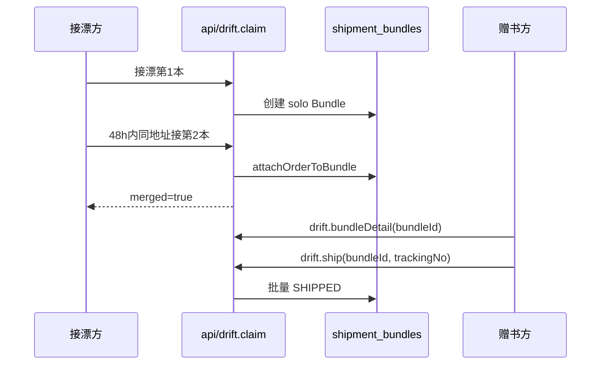

# 合并寄件 Bundle P1 设计说明

**日期：** 2026-06-22  
**状态：** 已确认，待实施（未编码）  
**适用项目：** 书漂漂 · 微信云开发版  
**合规边界：** 个人主体 · 公益流转信息记录 · 快递到付 · 平台不代收运费

**实施基线（开始开发前请确认）：**

- Git 分支建议：`feat/shipment-bundle-p1`（从 `main` 拉出，勿直接在 `main` 上改）
- 当前 `main` 已包含：统一发货页（`f2afabb`）、运单号校验、书单清理（`3921d1a`）
- 小程序包体积约 **1.4 MB**（低于 2 MB 主包上限，可安全加 Bundle UI）
- **尚未包含** 本方案任何后端/前端 Bundle 代码

---

## 1. 背景与目标

### 1.1 要解决的问题

| 现状 | 用户痛点 |
|------|----------|
| 每次接漂生成独立 `drift_order` | 同一领书方接同一赠书方多本 → 赠书方需多次寄件、多次填单号 |
| 发货页按 `orderId` 单笔操作 | 无法「一次寄出、多单共享运单号」 |
| `inflightLimit = 2` | 与「最多 5 本合并寄出」策略冲突 |

### 1.2 P1 目标

- **Bundle（包裹组）** 仅合并「寄件动作」：展示、复制地址、录入运单号
- **订单仍是结算单元**：公益积分、信用、申诉、评价仍按 `drift_order` 逐笔处理
- 接漂时 **自动归组**（同赠书方 + 同接漂方 + 同地址 + 48h 窗口）
- 赠书方 **一次运单号** → Bundle 内所有 `PENDING_SHIP` 订单变为 `SHIPPED`

### 1.3 明确不做（P1 范围外）

| 不做 | 说明 |
|------|------|
| P0 纯视觉分组 | 跳过，直接做后端 Bundle |
| Bundle 一键确认收货 | P1 保持 **逐单确认** |
| 手动合并/拆包 API | 仅自动归组 + 单笔取消移出 |
| 历史订单迁移脚本 | 无 `bundleId` 的旧单走单笔发货 fallback |
| 包邮/补贴/代付 | 合规禁止 |
| 具体运费金额展示 | 仅提示「到付」「凑单通常只需一次运费」 |

---

## 2. 已确认产品决策（2026-06-22）

以下为用户明确确认项，实施时 **不得擅自改动**：

1. **合并窗口 48h**；**Bundle 上限 5 本**
2. **单笔超时单独取消**，不拖垮整组（72h 发货 deadline 仍按 **单笔** `shipDeadlineAt`）
3. **直接做 P1 后端 Bundle**（不做 P0 假分组）
4. **P1 保持逐本确认收货**（接漂方每单各自点「确认收货」）
5. **`inflightLimit` 改为 5**，与 Bundle 上限一致；错误提示：「已有 5 单未收货，请先完成在途漂流」
6. **匿名漂流**：后端用 `giverId` 归组；池内 UI **禁止暴露昵称**，文案用 **「同一书友」**
7. **轻量书**：不限童书，**所有低积分书** — `coinValue ≤ 3` **或** `listPrice ≤ 20`
8. **UI 必须符合现有设计规范**（`miniprogram/styles/common.wxss`），并修正已知按钮风格问题（见 §7）

---

## 3. 设计原则

1. **订单仍是结算单元**，Bundle 只管寄件
2. **向后兼容**：无 `bundleId` 的订单 = 单本 Bundle，走现有 `orderId` 发货
3. **Deadline 以单为准**：维护任务超时取消仍逐单；UI 展示 Bundle 内 **最早** `shipDeadlineAt`
4. **地址隐私不变**：列表不返回完整地址；仅发货页 / 订单详情对赠书方展示 `addressSnapshot`
5. **不碰支付**：文案禁止「平台发货 / 代收运费 / 包邮」

---

## 4. 数据模型

### 4.1 新集合 `shipment_bundles`

| 字段 | 类型 | 说明 |
|------|------|------|
| `_id` | string | Bundle ID |
| `giverId` | string | 赠书方 userId |
| `receiverId` | string | 接漂方 userId |
| `addressKey` | string | 地址指纹（规范化 name+phone+region+detail 后 hash） |
| `addressSnapshot` | object | `{ name, phone, region, detail }` |
| `orderIds` | string[] | 当前组内 drift_order `_id` 列表（仅含未取消的待寄/在途） |
| `status` | string | `OPEN` / `SHIPPED` / `DISSOLVED` |
| `trackingNo` | string | 共享运单号（发货后写入） |
| `expressCompany` | string | 承运商 |
| `shippedAt` | string | ISO 时间 |
| `createdAt` / `updatedAt` | string | ISO 时间 |

### 4.2 `drift_orders` 扩展字段

| 字段 | 说明 |
|------|------|
| `bundleId` | 所属 Bundle `_id` |
| `bundleSeq` | 组内序号（1..5，便于 UI 展示） |

### 4.3 地址指纹 `addressKey`

对 `normalizeAddressSnapshot(address)` 结果拼接后做稳定 hash，用于判断「同一收件地址」。

### 4.4 自动归组条件（claim 时）

同时满足才并入已有 Bundle，否则新建 solo Bundle：

- 相同 `giverId` + `receiverId`
- 相同 `addressKey`
- 已有 Bundle 为 `OPEN` 且 `orderIds.length < 5`
- 最近一笔加入时间在 **48h** 内
- 新订单状态为 `PENDING_SHIP`

---

## 5. 核心业务规则

### 5.1 接漂 `drift.claim`

1. 校验 `inflightLimit`（改为 **5**）
2. 创建 `drift_order` 后调用 `attachOrderToBundle`
3. 若并入已有组，返回 `merged: true` + `bundleOrderCount`；前端 Toast：「已与上一本合并寄出」

### 5.2 发货 `drift.ship`

- 入参：`bundleId` **或** `orderId`（二选一，兼容旧单）
- 有 `bundleId`：将该 Bundle 内所有 `PENDING_SHIP` 订单批量 `SHIPPED`，写入同一 `trackingNo`
- 运单号校验：复用现有 `trackingNo.js`（前后端）

### 5.3 取消

- **单笔取消**（赠书方/接漂方）：只取消该 `drift_order`，并 `removeOrderFromBundle`
- Bundle 内仅剩 0 本待寄 → Bundle 标记 `DISSOLVED` 或更新 `orderIds`
- **单笔 72h 超时**：维护任务只取消该单，**不取消**同组其他单

### 5.4 收货

- **逐单** `drift.confirm`，与现网一致
- 接漂列表 / 详情可展示「同包裹 · N 本」标签（仅信息，不合并操作）

### 5.5 策略常量（`driftPolicy.js`）

```javascript
const BUNDLE_MERGE_WINDOW_HOURS = 48;
const BUNDLE_MAX_ORDERS = 5;
const LIGHTWEIGHT_COIN_THRESHOLD = 3;
const LIGHTWEIGHT_PRICE_THRESHOLD = 20;

// 各 stage 的 inflightLimit 均改为 5
```

```javascript
function isLightweightBook(book = {}) {
  const coin = Number(book.coinValue) || 0;
  const price = Number(book.listPrice) || 0;
  return coin <= LIGHTWEIGHT_COIN_THRESHOLD || price <= LIGHTWEIGHT_PRICE_THRESHOLD;
}
```

---

## 6. API 变更

### 6.1 新增 / 扩展 action

| Action | 说明 |
|--------|------|
| `drift.bundleDetail` | 入参 `bundleId` 或 `orderId`；返回 Bundle + 订单列表 + 地址 + 可操作项 |
| `drift.ship` | 扩展支持 `bundleId` 批量发货 |
| `drift.orderDetail` | 增加 `bundle.siblings`（同包裹其他订单摘要） |
| `pool.detail` | 增加 `sameGiverPool`、`lightweightHint` |

### 6.2 错误文案

| Code | 文案 |
|------|------|
| `INFLIGHT_LIMIT` | 已有 5 单未收货，请先完成在途漂流 |

### 6.3 新增云函数模块

- `cloudfunctions/api/lib/shipmentBundle.js` — 归组、拆出、加载、发货解析

### 6.4 集合注册

在以下文件中增加 `shipment_bundles`：

- `cloudfunctions/api/lib/collections.js`
- `cloudfunctions/init-db/collections.js`
- `cloudfunctions/seed/collections.js`（若存在）

---

## 7. 前端 UI 规范

**设计令牌**（与 `common.wxss` v3 一致）：

| 令牌 | 值 | 用途 |
|------|-----|------|
| 主绿 | `#2FBE77` | 主按钮、强调 |
| 深绿 | `#159E63` / `#0C7A4B` | 次级按钮文字、徽章 |
| 浅绿底 | `#EAFBF2` | 提示、pill |
| 危险 | `#C0442E` / `#FFF1ED` | 取消类 `.order-action.danger` |

### 7.1 组件使用约定

| 场景 | 规范 |
|------|------|
| 页面主提交 | `<button class="btn-primary">` |
| 次要操作 | `<button class="btn-ghost">` |
| 列表内药丸按钮 | `<view class="order-action primary\|secondary\|danger">`（与 `given` / `received` 一致） |
| **禁止** | 发货页主按钮用 `<view>` 冒充按钮（当前 `ship.wxml` 需改为 `<button>`） |

### 7.2 页面改动摘要

| 页面 | 改动 |
|------|------|
| **given** | 按 `bundleId` 分组；卡片显示「合并 N 本」；「去发货 ›」带 `bundleId` |
| **ship** | 支持 `?bundleId=`；多本列表；标题「合并寄出 · N 本」；一次填单号提交 |
| **claim** | 轻量 badge；合并提示；「未收货最多 5 单」 |
| **received** | 「同包裹 · N 本」badge |
| **order-detail** | 同包裹 siblings 列表 |
| **pool/detail** | 「同一书友还有 N 本可接」区块（匿名时不显示昵称）；轻量 badge |

### 7.3 文案规范

| 场景 | 匿名赠书 | 非匿名赠书 |
|------|----------|------------|
| 池内凑单 | **同一书友还有 N 本可接** | **还有 N 本在漂**（可带昵称，按现网策略） |
| 接漂成功合并 | 已与上一本合并寄出 | 同左 |

**禁止**：在匿名场景展示赠书方 `nickname` / 头像。

### 7.4 交互流程（Mermaid）



---

## 8. 文件级改动清单

### 8.1 新增

| 文件 | 说明 |
|------|------|
| `cloudfunctions/api/lib/shipmentBundle.js` | Bundle 核心逻辑 |
| `scripts/test-shipment-bundle-contract.js` | 契约测试 |

### 8.2 后端修改

| 文件 | 改动要点 |
|------|----------|
| `cloudfunctions/api/lib/driftPolicy.js` | `inflightLimit: 5`；Bundle/轻量常量；`isLightweightBook` |
| `cloudfunctions/api/handlers/drift.js` | claim 归组；`bundleDetail`；ship 支持 bundle；cancel 移出；orderDetail siblings |
| `cloudfunctions/api/handlers/pool.js` | `sameGiverPool`、`lightweightHint` |
| `cloudfunctions/api/index.js` | 路由 `drift.bundleDetail`；`INFLIGHT_LIMIT` 文案改 5 单 |
| `cloudfunctions/api/lib/collections.js` | + `shipment_bundles` |
| `cloudfunctions/init-db/collections.js` | + `shipment_bundles` |
| `cloudfunctions/seed/collections.js` | + `shipment_bundles` |

### 8.3 前端修改

| 文件 | 改动要点 |
|------|----------|
| `miniprogram/utils/api.js` | `getBundleDetail`、`shipBundle` |
| `miniprogram/pages/drift/given.js/wxml/wxss` | Bundle 分组与发货入口 |
| `miniprogram/pages/drift/ship.js/wxml/wxss` | 多本发货；按钮改 `<button class="btn-primary">` |
| `miniprogram/pages/drift/claim.js/wxml/wxss` | 轻量/合并/5单提示 |
| `miniprogram/pages/drift/received.wxml/wxss` | 同包裹 badge |
| `miniprogram/pages/drift/order-detail.wxml/wxss` | siblings 列表 |
| `miniprogram/pages/pool/detail.js/wxml/wxss` | 同一书友区块、轻量 badge |

### 8.4 测试更新

| 文件 | 改动 |
|------|------|
| `scripts/test-drift-policy.js` | `inflightLimit: 5` |
| `scripts/test-drift-fulfillment-contract.js` | Bundle 相关断言 |
| `scripts/test-drift-given-actions-contract.js` | 分组发货入口 |
| `scripts/test-drift-ship-page-contract.js` | bundle 发货页 |
| `scripts/test-pool-*` | 若涉及 sameGiver 文案则更新 |

---

## 9. 实施任务拆分（建议顺序）

| 序号 | 任务 | 依赖 |
|------|------|------|
| T1 | `shipmentBundle.js` + 集合注册 + `driftPolicy` 常量 | — |
| T2 | `drift.claim` 自动归组 | T1 |
| T3 | `drift.bundleDetail` + `drift.ship` 批量发货 | T1 |
| T4 | cancel / 维护任务移出 Bundle | T1 |
| T5 | `pool.detail` sameGiver + lightweight | T2 |
| T6 | 前端 given / ship / claim / received / order-detail / pool | T3,T5 |
| T7 | 契约测试 + 全量 `scripts/test-*.js` | T6 |

**每个 Task 完成后**：跑最相关 contract test → 再跑全量 suite。

---

## 10. 部署与验证

### 10.1 部署

1. 上传云函数 **`api`**（含 `shipmentBundle.js`）
2. 运行 **`init-db`** 或云开发控制台创建 **`shipment_bundles`**
3. 上传小程序前端

### 10.2 手工验收清单

- [ ] 同一赠书方 + 同地址 48h 内接 2 本 → given 显示「合并 2 本」，一次发货
- [ ] 第 6 本接漂失败或新建新 Bundle（上限 5）
- [ ] 取消其中 1 本 → 其余仍可发货
- [ ] 单笔 72h 超时 → 只取消该单
- [ ] 匿名赠书方 → 池内显示「同一书友」，无昵称
- [ ] 轻量书显示「轻量」badge
- [ ] 已有 5 单在途 → 接漂提示 inflight 上限
- [ ] 无 `bundleId` 旧订单 → 单笔发货仍正常

### 10.3 自动化

```bash
rtk proxy sh -c 'count=0; for f in scripts/test-*.js; do node "$f" || exit 1; count=$((count+1)); done; echo contract_tests=$count'
```

---

## 11. 新会话启动说明（复制即用）

```
项目：书漂漂 shupiaopiao-cloud
文档：docs/superpowers/specs/2026-06-22-shipment-bundle-p1-design.md
基线：main（含统一发货页 + 书单已清理，小程序约 1.4MB）
分支：feat/shipment-bundle-p1（从 main 新建）

请按文档 §2 已确认决策实施 Bundle P1，不要改 main。
完成后跑全量 contract tests，并列出需上传的云函数。
```

---

## 12. 修订记录

| 日期 | 说明 |
|------|------|
| 2026-06-22 | 用户确认 P1 范围；inflightLimit=5；匿名/轻量/UI 规范；文档创建（未编码） |
