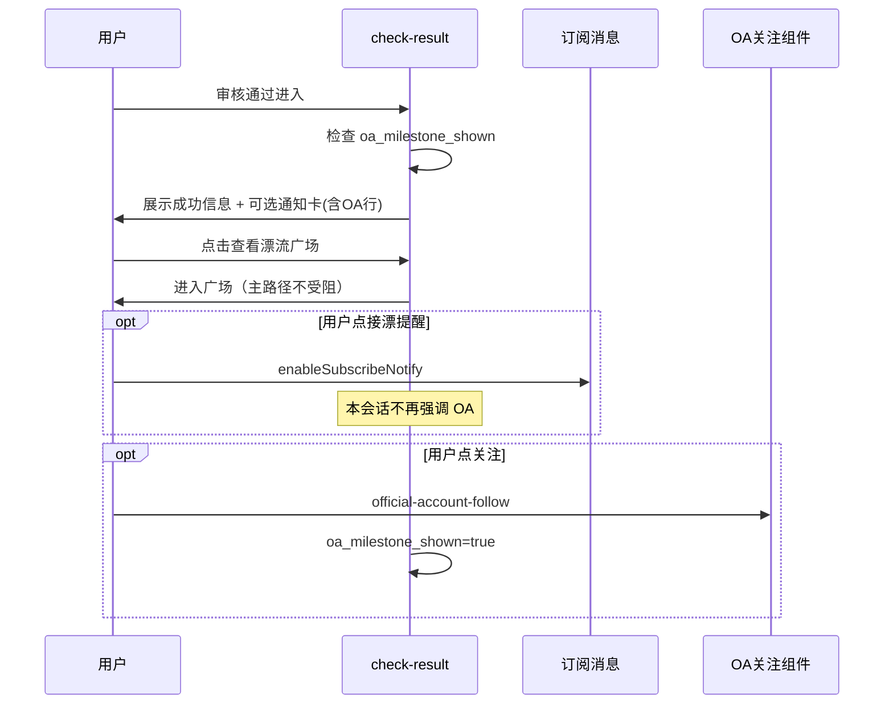
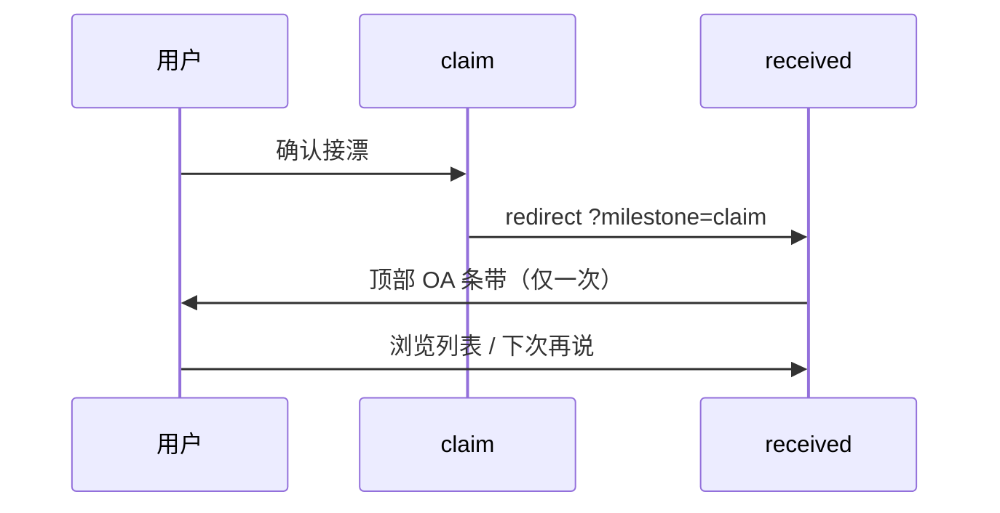

# 小程序内引导关注公众号 · 交互稿（方案 B + A）

**日期**：2026-06-27  
**状态**：已确认 · 已实现  
**范围**：仅交互与文案；不含开发排期  
**原则**：少打扰、价值先行、与现有订阅消息/邀请/share 不冲突

---

## 1. 目标

在小程序内以 **低打扰** 方式引导用户关注同名公众号「书漂漂」，用于：

- 新手指南、FAQ 的长期回看
- 漂流故事、每周精选等内容触达
- 与小程序订阅消息分工：小程序管「你的订单」，公众号管「玩法与内容」

**不做**：启动弹窗、功能 gating、关注送积分/公益积分。

---

## 2. 现有交互审计（冲突基线）

实施前已核对各落点页面现有元素，避免叠加打扰。

| 页面 | 现有引导/弹层 | 冲突等级 | 结论 |
|------|----------------|----------|------|
| `check-result`（上漂成功） | 「接漂时微信提醒我」按钮 + 可选说明；主按钮「查看漂流广场 / 继续扫码上漂」 | **高** | 不宜再叠第三块独立 OA 卡片；改为 **并入同一「可选通知」区** |
| `batch-result`（批量上漂） | 仅结果列表 + 两个按钮，无订阅入口 | 低 | 可作为上漂里程碑备选落点 |
| `claim`（接漂确认） | 提交后 toast → 1s 跳转 `received`，无成功页 | 中 | 里程碑改在 `received` 顶部条带展示 |
| `ship`（发货） | 提交后跳转 `order-detail`，无庆祝页 | 中 | 里程碑改在 `order-detail` 顶部条带展示 |
| `order-detail` | 确认收货/取消等 `showModal`（用户主动触发） | 低 | 可放顶部只读条带，不用 modal |
| `given` | 待发货提醒卡 + 「开启微信提醒 ›」 | 中 | **不做** OA 里程碑（与 subscribe 同主题） |
| `mine/index` | 菜单 + 底部「邀请书友共建」 | 低 | 方案 A 常驻卡片放 **菜单与邀请之间** |
| `pool/index` | 「获得积分」→ 用户点击才出 modal | 无 | 无冲突 |
| `app.onLaunch` | 无自动弹层 | 无 | 保持 |

**全局禁止**

- 与 `wx.requestSubscribeMessage` **同一次页面访问**内再自动展开 OA 条带
- 全屏 modal / 启动拦截 / 接漂前强制关注
- 文案含「关注送积分」「关注解锁」等（见 compliance contract）

---

## 3. 方案概览

| 方案 | 形态 | 频次 | 作用 |
|------|------|------|------|
| **A · 常驻** | 「我的」页轻卡片 + `<official-account-follow>` | 常驻；用户可关闭后 30 天内不再显示 | 被动入口，长期可见 |
| **B · 里程碑** | 成功场景顶部/底部 **内联条带**（非 modal） | **全生命周期最多 1 次** | 在用户刚获得价值时轻提示 |

B 与 A 独立计数：用户关闭 B 条带不影响 A 卡片（A 有自己的 dismiss 逻辑）。

---

## 4. 全局频控与存储

```text
Storage keys（建议前缀 oa_）:

oa_milestone_shown: boolean          // B 是否已展示过（任一里程碑触发后置 true）
oa_milestone_dismissed_at: number     // B 用户点「下次再说」的时间戳
oa_mine_card_dismissed_at: number     // A 用户关闭卡片的时间戳
oa_subscribe_dialog_session: boolean  // 本会话是否触发过订阅消息弹窗（内存即可）
```

| 规则 ID | 规则 |
|---------|------|
| R1 | B：**一生只自动出现 1 次**（首个满足的里程碑） |
| R2 | B 用户点「下次再说」→ 写入 `oa_milestone_shown=true`，永不再自动出现 |
| R3 | A：用户点右上角 × → `oa_mine_card_dismissed_at=now`，**30 天内**不显示 A |
| R4 | 若本会话用户点击过「接漂时微信提醒我 / 开启微信提醒」并触发系统订阅弹窗 → **本会话跳过 B**（避免双弹窗感知） |
| R5 | 未登录用户：A 卡片可见但文案为「登录后可接收玩法更新」；B 仅在已登录且完成里程碑时展示 |
| R6 | 任意 B 条带 **不得** 使用 `wx.showModal` 自动弹出 |

**里程碑优先级**（仅首个生效）：

1. 首次上漂审核通过（`check-result` passed / `batch-result` successCount≥1）
2. 首次接漂提交成功（跳转 `received`）
3. 首次发货成功（跳转 `order-detail`）

---

## 5. 方案 A · 「我的」常驻卡片

### 5.1 位置

`mine/index.wxml`：**菜单列表 `.menu-list` 下方、邀请块 `.invite-block` 上方**。

理由：与「邀请书友共建」区分——邀请是拉新，公众号是内容与玩法；避免两个绿色主按钮并排竞争。

### 5.2 线框（ASCII）

```text
┌─────────────────────────────────────┐
│ 隐私政策 / 设置                  › │
└─────────────────────────────────────┘

┌─────────────────────────────────────┐  ← 新增 A
│ 书漂漂公众号              [×]       │
│ 新手指南、漂流故事与常见问题         │
│ ┌─────────────────────────────┐     │
│  │  [ official-account-follow ] │  │  微信官方关注组件
│  └─────────────────────────────┘     │
│  可选；不影响小程序内漂流与积分       │
└─────────────────────────────────────┘

┌─────────────────────────────────────┐
│ 邀请书友共建              [邀请]    │  ← 现有
│ 书架闲置清出去…                      │
└─────────────────────────────────────┘
```

### 5.3 文案

| 元素 | 文案 |
|------|------|
| 标题 | 书漂漂公众号 |
| 副标题 | 新手指南、漂流故事与常见问题 |
| 合规说明 | 可选；不影响小程序内漂流与积分 |
| 关闭 | 右上角 ×，无二次确认 |

### 5.4 样式约束

- 背景 `#F7FBF8`，边框 `#E7EEE9`（弱于菜单白卡、弱于邀请绿按钮）
- **不要** 使用与 `.btn-primary` / `.invite-share-btn` 相同的主绿实心按钮
- 关注组件宽度 100%，高度由组件自适应

### 5.5 显示条件

```text
showMineOaCard =
  !within30Days(oa_mine_card_dismissed_at)
  && officialAccountComponentAvailable   // 关联公众号且基础库支持
```

游客：显示卡片；关注组件仍可用（微信侧处理）。

---

## 6. 方案 B · 里程碑内联条带

### 6.1 组件规格（建议新建 `official-account-tip-bar`）

| 属性 | 说明 |
|------|------|
| 形态 | 页面内 **内联条带**，非 mask、非 modal |
| 位置 | 页面 **顶部**（列表页）或 **主 CTA 下方**（成功页） |
| 结构 | 一行标题 + 一行说明 + 关注组件 + 文字链「下次再说」 |
| 高度 | 目标 ≤ 200rpx（不含关注组件），整体不超过一屏 1/4 |

**禁止**：自动 `wx.showModal`、全屏遮罩、倒计时强制。

### 6.2 触达矩阵

| 里程碑 | 落点页面 | 展示位置 | 是否采用 | 原因 |
|--------|----------|----------|----------|------|
| 首次上漂成功（单本/扫码） | `check-result` | 主按钮 **下方** | **采用（改造）** | 与订阅按钮 **合并为同一「可选通知」区**，见 6.3 |
| 首次批量上漂 | `batch-result` | 主按钮下方 | 采用 | 无订阅冲突，结构简单 |
| 首次接漂 | `received` | 列表 **顶部** 条带 | 采用 | `claim` 无成功页；带 `?milestone=claim` |
| 首次发货 | `order-detail` | 书籍卡片 **下方** | 采用 | `ship` 跳转带 `?milestone=ship` |
| 待发货列表 | `given` | — | **不做** | 已有「开启微信提醒」 |
| 接漂前 | `claim` | — | **不做** | 阻断主流程 |

### 6.3 `check-result` 专项改造（解决订阅冲突）

**现状问题**：已通过页已有「接漂时微信提醒我」+ 主按钮；若再插 OA 块，纵向 4 层 CTA，打扰过重。

**改造**：将订阅与 OA 收进 **一个**「可选通知」卡片（仅 `passed=true` 且 `oa_milestone_shown=false` 时在该卡内多一行 OA）。

```text
┌─ 可选通知 ─────────────────────────┐
│ ① 接漂时微信提醒我          [按钮]   │  ← 现有 subscribe，保留
│    可选；拒绝不影响漂流与发货         │
│ ─ ─ ─ ─ ─ ─ ─ ─ ─ ─ ─ ─ ─ ─ ─ ─   │
│ ② 关注公众号 · 玩法指南与故事       │  ← 仅 B 首次时显示此行
│    [ official-account-follow ]      │
│    [ 下次再说 ]                     │
└────────────────────────────────────┘

[ 查看漂流广场 ]  ← 主 CTA 保持最下方、最醒目
```

**交互顺序**

1. 用户进入 `check-result`（首次上漂通过）
2. 若满足 R1–R4，展示合并后的「可选通知」卡（含 OA 行）
3. 用户点 ① → 走现有 `enableSubscribeNotify`；**本会话不再强调 OA**（R4）
4. 用户点「下次再说」→ `oa_milestone_shown=true`，OA 行消失，① 仍保留
5. 用户点关注组件 → 埋点 `oa_follow_click`，`oa_milestone_shown=true`

**批量扫码连续上漂**（`continueScan=1`）：仍显示合并卡，但 OA 行遵循 R1；主按钮优先「继续扫码上漂」。

### 6.4 `batch-result`

```text
[ 批量上漂已提交 · 成功 N 本 ]

[ 继续选书上漂 ]
[ 查看漂流广场 ]

┌─ 可选 ─────────────────────────────┐
│ 关注书漂漂公众号                    │
│ 新手指南与漂流故事，方便随时回看     │
│ [ official-account-follow ]         │
│ [ 下次再说 ]                        │
└────────────────────────────────────┘
```

显示条件：`successCount >= 1` && !`oa_milestone_shown` && R4。

### 6.5 `received`（首次接漂）

跳转改造：

```javascript
// claim.js confirm 成功后
wx.redirectTo({ url: '/pages/drift/received?milestone=claim' });
```

条带位置：`status-tabs` **下方**、订单列表 **上方**。

| 元素 | 文案 |
|------|------|
| 标题 | 接漂申请已提交 |
| 说明 | 公众号会整理发货步骤与常见问题，需要时可回看 |
| 次要 | 下次再说 |

**注意**：此页无 celebrate 动画；条带为淡绿底 `#F0FAF4`，**不** toast 后再弹层。

若用户从 tab 正常进入 `received`（无 query）→ 不展示 B。

### 6.6 `order-detail`（首次发货）

跳转改造：

```javascript
// ship.js submit 成功后
wx.redirectTo({
  url: `/pages/drift/order-detail?orderId=${id}&role=given&milestone=ship`,
});
```

条带位置：第一本书卡片 **下方**、积分说明 **上方**。

| 元素 | 文案 |
|------|------|
| 标题 | 发货成功 |
| 说明 | 关注公众号可查看寄送说明与漂流进展案例 |
| 次要 | 下次再说 |

---

## 7. 文案规范（合规）

### 7.1 可用

- 「新手指南、漂流故事与常见问题」
- 「可选；不影响小程序内漂流与积分」
- 「方便随时回看操作步骤」
- 「公众号会整理发货步骤与常见问题」

### 7.2 禁用

- 关注送积分 / 关注领奖励 / 关注解锁功能
- 必须关注才能继续接漂、上漂、发货
- 钱包、返现、赚钱

与 `scripts/test-compliance-p0-contract.js` 保持一致；新增 contract 断言禁用词。

---

## 8. 与订阅消息的分工（用户可见说明）

在 A 卡片与 B 条带说明中统一隐含以下分工，**不必单独开一段教育文案**：

| 渠道 | 用户感知 |
|------|----------|
| 小程序订阅消息 | 有人接漂、催发货等 **与我有关** 的即时提醒 |
| 公众号 | 玩法指南、故事、FAQ 等 **慢慢看** 的内容 |

`check-result` 合并卡中，① 与 ② 的副标题应体现差异，避免「两个提醒好像一样」。

---

## 9. 技术前置

1. 微信公众平台：小程序与公众号 **同主体关联**
2. 基础库：支持 `<official-account-follow>`（低版本降级为「了解公众号 ›」→ `wx.openOfficialAccountProfile`）
3. 配置：`miniprogram/config/index.js` 增加 `officialAccountUsername`（公众号原始 ID 或 appId，按组件文档）
4. 埋点建议：
   - `oa_milestone_show` `{ scene: publish|batch|claim|ship }`
   - `oa_milestone_dismiss`
   - `oa_follow_click` `{ scene }`
   - `oa_mine_card_show` / `oa_mine_card_dismiss`

---

## 10. 页面级交互时序

### 10.1 首次上漂（单本）



### 10.2 首次接漂



---

## 11. 验收标准

| # | 标准 |
|---|------|
| AC1 | 新用户全生命周期 B 条带 **最多自动出现 1 次** |
| AC2 | `check-result` 通过页主 CTA 仍为最醒目；OA 不在主 CTA 之上独立占大块 |
| AC3 | 同页访问触发订阅弹窗后，不再自动强调 OA（R4） |
| AC4 | A 卡片关闭后 30 天内不显示；B dismiss 后永不再自动出现 |
| AC5 | 无任何自动 `showModal` 推广公众号 |
| AC6 | 文案通过 compliance 禁用词检查 |
| AC7 | `given`、启动、登录、接漂确认页 **无** OA 自动引导 |

---

## 12. 建议实施顺序

1. 配置公众号关联 + `official-account-tip-bar` / mine 卡片组件
2. **方案 A**（mine 常驻）— 风险最低，可先上线观察
3. **`batch-result` + `received` + `order-detail`** 的 B 条带 — 无订阅冲突
4. **`check-result` 合并「可选通知」区** — 需改 wxml 结构，并更新 `test-subscribe-message-contract.js` 断言（仍保留 subscribe 按钮与合规说明）

---

## 13. 未纳入本期

- 漂流玩法页 `drift/guide` 延伸阅读（方案 C）
- 设置页独立入口
- 关注状态服务端校验 / 送权益
- 公众号文章内嵌 web-view

---

## 附录 A · 各页面改动文件清单（实现参考）

| 文件 | 改动 |
|------|------|
| `miniprogram/pages/mine/index.wxml|wxss|js` | A 卡片 |
| `miniprogram/pages/drift/check-result.wxml|wxss|js` | 合并可选通知区 |
| `miniprogram/pages/drift/batch-result.wxml|wxss|js` | B 条带 |
| `miniprogram/pages/drift/claim.js` | 跳转带 milestone |
| `miniprogram/pages/drift/received.wxml|wxss|js` | B 条带 |
| `miniprogram/pages/drift/ship.js` | 跳转带 milestone |
| `miniprogram/pages/drift/order-detail.wxml|wxss|js` | B 条带 |
| `miniprogram/utils/officialAccountPrompt.js` | 频控 + 存储（新建） |
| `miniprogram/components/official-account-tip-bar/*` | 条带组件（新建） |
| `miniprogram/config/index.js` | 公众号配置 |
| `scripts/test-official-account-prompt-contract.js` | 合规与频控 contract（新建） |
